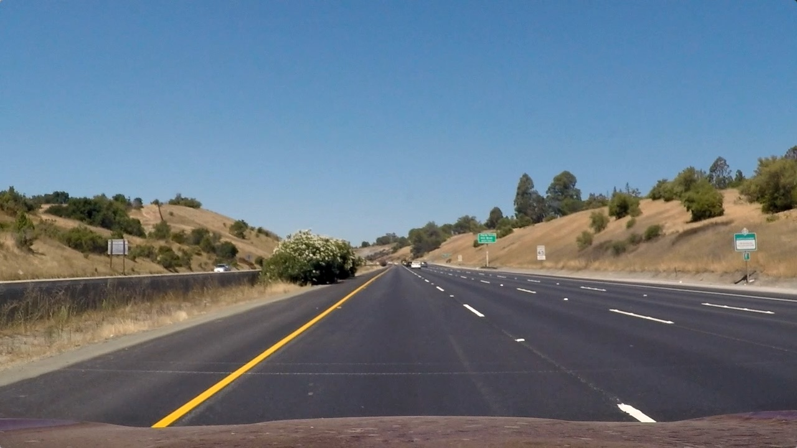
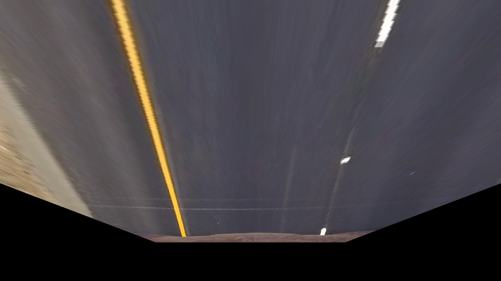

# GPU BEV on Bubbaloop + Kornia-RS Upstream

A real-time Bird's Eye View camera pipeline in Rust that demonstrates GPU-accelerated perspective
warp for edge-oriented deployment.

This repository serves two purposes:

- a working Bubbaloop-style application pipeline (Zenoh ingest -> process -> publish), and
- an upstream staging area for kornia-rs operation/backend contributions.

## Project Objective

Design and upstream a hardware-agnostic, low-allocation GPU backend for kornia-rs using
CubeCL. This repository serves as the staging ground for the library API and uses a live
Bubbaloop Zenoh node exclusively as a real-world integration test to validate end-to-end
latency on edge hardware.

## Project Abstract

High-performance edge vision in robotics is still dominated by CUDA-first pipelines, which
limits portability across heterogeneous hardware and slows adoption in the Rust ecosystem.
This project proposes a hardware-agnostic GPU backend for kornia-rs using CubeCL/WGPU,
including persistent VRAM pooling and async-safe execution for operations such as
`warp_perspective`. The final deliverable is a reusable upstream library backend validated by
an end-to-end Zenoh/Bubbaloop BEV pipeline suitable for real robotics deployment.

## Problem Statement

Current robotics vision stacks typically force one of three trade-offs:

- Python pipelines are fast to iterate, but often struggle with deterministic low-latency edge deployment.
- C++/CUDA pipelines can be high performance, but are frequently vendor-specific and harder to maintain safely.
- Existing Rust robotics projects often keep middleware and GPU compute in app-specific silos instead of reusable upstream libraries.

This project targets the missing middle: a reusable, memory-safe, hardware-agnostic GPU
backend for Rust computer vision that integrates cleanly with lightweight middleware such as Zenoh.

## Architecture

Two-layer architecture:

1. Library Layer (kornia-rs target)
- Pure operation API and backend implementations.
- No knowledge of network transport, camera topics, or viewer windows.

2. Application Layer (Bubbaloop target)
- Zenoh subscribe/publish, JPEG/PNG decode/encode, runtime orchestration.
- Calls operation API from the library layer.

## Processing Pipeline

```
Camera Frames (JPEG/PNG/RAW)
  |
  v
Zenoh Subscriber
  |
  v
Decode to RGB8 (CPU)
  |  (offloaded via Tokio blocking workers)
  |
  v
Pack RGB24 -> u32
  |
  v
warp_perspective operation API
  |
  +--> CPU backend (reference)
  |
  +--> CubeCL/WGPU backend (GPU)
  |
  v
Unpack u32 -> RGB24
  |
  v
Encode (optional JPEG, CPU)
  |  (offloaded via Tokio blocking workers)
  |
  v
Zenoh Publisher
```

## Project Structure

```
src/
├── main.rs                        # Live Zenoh BEV node (application layer)
├── lib.rs                         # Library exports
├── backend/
│   ├── mod.rs                     # ImageProcessor trait + backend exports
│   ├── cpu_backend.rs             # CPU reference warp backend
│   └── cubecl_backend.rs          # Persistent CubeCL/WGPU backend
├── imgproc/
│   ├── mod.rs                     # imgproc module exports
│   └── warp_perspective.rs        # Operation-level API wrapper
├── math/
│   ├── mod.rs
│   └── homography.rs              # IPM and homography utilities
├── nodes/
│   ├── mod.rs
│   ├── gpu_warp.rs                # CubeCL perspective warp kernel
└── bin/
    ├── camera_publisher.rs        # Demo camera publisher
    ├── bev_viewer.rs              # Frame viewer
    └── warp_bench.rs              # OpenCV-reference benchmark utility
```

## Prerequisites

- Git
- Rust (stable, edition 2024) via rustup
- C/C++ build toolchain (needed by Rust crates during compilation)
- Python 3.10+ with venv support (for benchmark helper script)
- GPU driver/runtime compatible with wgpu
- Optional desktop session for `bev_viewer` binary

## Setup (Step by Step for Each OS)

Follow one OS section completely, then continue to Build and Run.

### Linux (Ubuntu/Debian)

1. Install system packages:

```bash
sudo apt update
sudo apt install -y \
  git curl build-essential pkg-config cmake clang libssl-dev \
  python3 python3-venv python3-pip \
  libx11-dev libxrandr-dev libxcursor-dev libxi-dev \
  libvulkan1 vulkan-tools mesa-vulkan-drivers
```

2. Install Rust:

```bash
curl --proto '=https' --tlsv1.2 -sSf https://sh.rustup.rs | sh
source "$HOME/.cargo/env"
rustup default stable
```

3. Clone project:

```bash
git clone https://github.com/AnilKumarSingh9856/bubbaloop-gpu-bev.git
cd bubbaloop-gpu-bev
```

4. Create Python virtual environment and install benchmark dependencies:

```bash
python3 -m venv .venv
source .venv/bin/activate
python -m pip install --upgrade pip
python -m pip install opencv-python numpy
```

5. Verify setup:

```bash
rustc --version
cargo --version
python --version
vulkaninfo | head -n 20
```

### macOS (MacBook)

1. Install Xcode command line tools:

```bash
xcode-select --install
```

2. Install Homebrew (if missing), then required packages:

```bash
/bin/bash -c "$(curl -fsSL https://raw.githubusercontent.com/Homebrew/install/HEAD/install.sh)"
brew install git python pkg-config cmake
```

3. Install Rust:

```bash
curl --proto '=https' --tlsv1.2 -sSf https://sh.rustup.rs | sh
source "$HOME/.cargo/env"
rustup default stable
```

4. Clone project:

```bash
git clone https://github.com/AnilKumarSingh9856/bubbaloop-gpu-bev.git
cd bubbaloop-gpu-bev
```

5. Create Python virtual environment and install benchmark dependencies:

```bash
python3 -m venv .venv
source .venv/bin/activate
python -m pip install --upgrade pip
python -m pip install opencv-python numpy
```

6. Verify setup:

```bash
rustc --version
cargo --version
python3 --version
```

Notes:

- wgpu uses Metal on macOS; no separate Vulkan installation is required.
- If you use Apple Silicon, run in a native arm64 terminal for best compatibility/performance.

### Windows 10/11 (PowerShell)

1. Install required tools (run PowerShell as Administrator):

```powershell
winget install --id Git.Git -e
winget install --id Rustlang.Rustup -e
winget install --id Python.Python.3.12 -e
```

2. Install Visual C++ build tools:

- Install "Visual Studio 2022 Build Tools" from Microsoft.
- During install, select the workload: "Desktop development with C++".

3. Restart PowerShell, then set Rust stable as default:

```powershell
rustup default stable
```

4. Clone project:

```powershell
git clone https://github.com/AnilKumarSingh9856/bubbaloop-gpu-bev.git
cd bubbaloop-gpu-bev
```

5. Create Python virtual environment and install benchmark dependencies:

```powershell
# Allow local venv activation scripts in PowerShell (one-time for current user)
Set-ExecutionPolicy -ExecutionPolicy RemoteSigned -Scope CurrentUser
py -3 -m venv .venv
.\.venv\Scripts\Activate.ps1
python -m pip install --upgrade pip
python -m pip install opencv-python numpy
```

6. Verify setup:

```powershell
rustc --version
cargo --version
python --version
```

Notes:

- Keep your GPU driver updated (NVIDIA/AMD/Intel) so wgpu can access modern graphics APIs.
- If viewer build fails, ensure Desktop C++ tools are installed and you are using a normal desktop session.

## Quick First Build Check (All OS)

```bash
cargo check
```

If this command succeeds, the project dependencies are installed correctly.

## Build and Run

The run commands below use Bash-style environment variables.

- Linux/macOS: run commands exactly as shown.
- Windows PowerShell: set variables first, then run cargo. Example:

```powershell
$env:CAM_WIDTH="1280"
$env:CAM_HEIGHT="720"
cargo run --release --bin gpu-bev-node
```

```bash
# Build sanity check
cargo check
```

### 1) Live GPU Node

```bash
CAM_WIDTH=1280 CAM_HEIGHT=720 \
BEV_BENCH=1 BEV_BENCH_WARMUP=30 BEV_BENCH_EVERY=60 BEV_LOOP_DELAY_MS=0 \
cargo run --release --bin gpu-bev-node
```

### 2) Publisher (Single Image Input)

```bash
CAM_WIDTH=1280 CAM_HEIGHT=720 \
CAM_PUB_PATH=input_images/frame.jpg CAM_PUB_FPS=5 CAM_PUB_LOOP=1 \
cargo run --bin camera_publisher
```

### 3) Optional Viewer

```bash
cargo run --release --features viewer --bin bev_viewer
```

## OpenCV Reference Benchmark

Step 1: Generate OpenCV reference output:

```bash
source .venv/bin/activate
python tools/verify_accuracy.py
```

Windows PowerShell equivalent:

```powershell
# Allow local venv activation scripts in PowerShell (one-time for current user)
Set-ExecutionPolicy -ExecutionPolicy RemoteSigned -Scope CurrentUser
.\.venv\Scripts\Activate.ps1
python tools/verify_accuracy.py
```

Step 2: Run Rust GPU benchmark against OpenCV output:

```bash
CAM_WIDTH=1280 CAM_HEIGHT=720 \
BENCH_IMAGE_PATH=input_images/frame.jpg BENCH_OPENCV_REF=output_images/opencv_baseline_frame1.png \
BENCH_WARMUP=10 BENCH_ITERS=100 BENCH_SAVE_OUTPUTS=1 \
cargo run --release --bin warp_bench
```

Benchmark output includes:

- GPU average latency
- Mean pixel difference against OpenCV output
- Max pixel difference against OpenCV output

## Visual Validation

### Input Frame



### Output Comparison (OpenCV vs Rust GPU)

| OpenCV Output | Rust GPU Output |
|---|---|
|  |  |

These output images are generated by the benchmark binary when `BENCH_SAVE_OUTPUTS=1`.

## Benchmark Report (Latest Run)

Command used:

```bash
CAM_WIDTH=1280 CAM_HEIGHT=720 \
BENCH_IMAGE_PATH=input_images/frame.jpg BENCH_OPENCV_REF=output_images/opencv_baseline_frame1.png \
BENCH_WARMUP=10 BENCH_ITERS=100 BENCH_SAVE_OUTPUTS=1 \
cargo run --release --bin warp_bench
```

Measured results on this machine:

| Metric | Value |
|---|---|
| Resolution | 1280x720 |
| Iterations | 100 |
| OpenCV warp time (Rust-matrix baseline, single run) | 2.84 ms |
| GPU avg total | 3.998 ms |
| Mean abs pixel diff (GPU vs OpenCV) | 1.3441 |
| Max abs pixel diff (GPU vs OpenCV) | 189 |
| Match <=1 intensity diff | 80.87% |
| Match <=2 intensity diff | 89.44% |
| Match <=4 intensity diff | 95.09% |

**Interpretation:** The Rust GPU pipeline is functioning end-to-end and produces accurate BEV
output against the OpenCV baseline using the same Rust-derived homography model.

**Performance Reality Check:** The current GPU benchmark result (3.998 ms) is close to the
OpenCV baseline measurement (2.84 ms, single run), which indicates the pipeline is now
compute-capable but still dominated by host-side integration overhead in this end-to-end setup.

**Bottleneck Identification:** The benchmark currently includes non-trivial overhead from
host-side orchestration, including JPEG decode/encode CPU cost and Host-to-Device/Device-to-Host
transfer cost. CubeCL backend resources are persistent; remaining overhead is dominated by data
movement and codec boundaries rather than per-frame backend initialization.

**Primary GSoC Target:** The core objective is upstreaming this proven, persistent VRAM buffer
pooling and long-lived runtime architecture into the kornia-rs backend dispatch system, allowing
the broader library to bypass per-frame initialization bottlenecks while executing tensor
operations.

### Additional Input Runs

The same benchmark flow was also executed on two additional input frames in
`input_images/frame2.jpg` and `input_images/frame3.jpg`.

| Input | OpenCV Baseline | Rust GPU Output | GPU avg total | Mean abs diff | Max abs diff | Match <=1 | Match <=2 | Match <=4 |
|---|---|---|---:|---:|---:|---:|---:|---:|
| `input_images/frame2.jpg` | `output_images/opencv_baseline_frame2.jpg` | `output_images/bench_output_gpu_frame2.jpg` | 5.640 ms | 1.5783 | 192 | 71.93% | 85.26% | 95.02% |
| `input_images/frame3.jpg` | `output_images/opencv_baseline_frame3.jpg` | `output_images/bench_output_gpu_frame3.jpg` | 5.531 ms | 2.0832 | 188 | 64.19% | 76.77% | 88.44% |

## Allocation Notes

- CubeCL backend allocates GPU buffers once and reuses them across calls.
- The Rust hot path avoids per-frame `Vec<u32>` output allocation inside this crate's readback
  path.
- Current application flow still performs an owned payload copy for compressed-input decode
  handoff to blocking workers (`payload -> Vec<u8>`). This is an acknowledged app-layer trade-off
  to keep the async network path non-blocking.

## Implemented

- Live Zenoh BEV node with decode -> warp -> publish path.
- CubeCL perspective warp kernel in Rust.
- Persistent CubeCL/WGPU backend (reuses client/queue/buffers/handles).
- Async-safe backend API and runtime calls (no `pollster::block_on` in processing path).
- Operation-level API wrapper for warp perspective.
- CPU reference backend for comparison.
- OpenCV-reference benchmark binary.
- Frame publisher and viewer binaries for demos.
- IPM homography configuration from environment variables.
- GPU kernel guard rails for divide-by-zero and negative source-coordinate bounds checks.
- Viewer/node JPEG and PNG codec stages moved to blocking workers to avoid async runtime stalls.
- Stage-level benchmark logging for live pipeline (decode/pack/h2d/kernel/d2h/unpack/encode).

## Kornia Crate Coverage

| Crate | Current usage in this repo | Implemented status | Remaining upstream work |
|---|---|---|---|
| kornia-imgproc | Operation-facing warp flow and backend-dispatched perspective warp design | In progress | Upstream public warp API, backend dispatch integration, tests |
| kornia-image | Image container/types for decode scratch buffers and benchmark artifacts | Implemented in runtime flow | Keep as-is; align with tensor-native API contracts during upstreaming |
| kornia-io | JPEG/PNG decode and encode in node, viewer, publisher, benchmark tooling | Implemented in runtime flow | Upstream I/O helper usage patterns if needed for benchmark fixtures |
| kornia-tensor | Dependency included for target architecture alignment | Planned | Implement tensor-native warp API path and shape/stride-safe conversion strategy |

Notes:

- Current prototype computes with packed `u32` pixels for kernel bring-up and benchmarking.
- Upstream kornia-rs contribution should converge on tensor-native APIs centered on kornia-tensor.

## 12-Week GSoC Execution Plan

| Week | Phase | Focus and Deliverables | Exit Criteria |
|---|---|---|---|
| 1-3 | Kornia-RS API | Define ImageProcessor traits and operation boundaries in kornia-imgproc, implement tensor-native input/output layouts, and wire the standard CPU fallback path with tests and examples. | Draft PR for kornia-imgproc opened with API docs, compile-green tests, and reviewable usage example. |
| 4-6 | CubeCL Backend | Integrate CubeCLBackend into kornia backend dispatch logic and implement persistent WGPU context plus VRAM buffer pooling to reduce Host-to-Device transfer overhead. | Backend-dispatch PR opened, persistent resource path merged locally, and benchmark shows reduced transfer/setup share relative to current baseline. |
| 7-9 | Validation | Implement strict CPU-vs-GPU mathematical parity tests, build CI-compatible fixture tests, and finalize benchmark harness to demonstrate optimized GPU speedup after memory-path improvements. | CI-ready parity test suite passing and benchmark script producing reproducible report artifacts for CPU/GPU/OpenCV comparison. |
| 10-12 | Bubbaloop and Edge | Replace direct Bubbaloop app logic with the upstream kornia-rs API, deploy on NVIDIA Jetson Orin-class hardware, and publish final demo video with latency and throughput reporting. | End-to-end edge run validated on Jetson Orin-class device, final metrics table published, and upstream PR links consolidated in final report. |

## Related Work and Competitive Analysis

### Middleware and Edge Peers (Zenoh + Robotics)

- [`NEWSLabNTU/ntu-zenoh_remote_driving`](https://github.com/NEWSLabNTU/ntu-zenoh_remote_driving): Zenoh-based camera streaming on Jetson-class edge hardware for remote driving.
- [`eclipse-zenoh/zenoh-plugin-ros2dds`](https://github.com/eclipse-zenoh/zenoh-plugin-ros2dds): Official ROS2 bridge used widely for ROS2 interoperability and distributed liveliness patterns.

### GPU Backend Peers (CubeCL + WGPU)

- [`tracel-ai/cubecl`](https://github.com/tracel-ai/cubecl): Core compute language/runtime ecosystem that underpins this backend direction.
- [`rerun-io/rerun`](https://github.com/rerun-io/rerun): Strong Rust/WGPU reference for high-throughput real-time vision and robotics visualization.

### BEV and IPM Peers (Math and Calibration)

- [`ika-rwth-aachen/Cam2BEV`](https://github.com/ika-rwth-aachen/Cam2BEV): Multi-camera BEV workflow with deep-learning emphasis.
- [`DrMahdiRezaei/Birds-Eye-View-Calibration`](https://github.com/DrMahdiRezaei/Birds-Eye-View-Calibration): Classical calibration and IPM toolkit in Python/OpenCV.

### Comparative Positioning

| Feature | Traditional Python/C++ Pipelines | Existing Zenoh Robotics Apps | This Project (Bubbaloop + kornia-rs target) |
|---|---|---|---|
| Language | Python or C++ | Rust app plus external GPU stacks | Pure Rust implementation path |
| GPU Portability | Often CUDA/NVIDIA-only | Often DeepStream/TensorRT-centered | CubeCL/WGPU (Vulkan, Metal, DX12 capable) |
| Middleware | Commonly ROS2-heavy | Zenoh-centric app logic | Zenoh integration plus reusable upstream backend |
| Memory Strategy | Frequent per-frame allocations | App-specific optimizations | Persistent resources with VRAM reuse |
| Reusability | Often standalone application code | Node-specific implementation | Upstream-oriented library contribution |

### Why This Matters for kornia-rs

- Converts app-level optimization into reusable backend infrastructure for the wider Rust CV ecosystem.
- Reduces vendor lock-in by using portable GPU abstractions rather than CUDA-only assumptions.
- Bridges low-latency middleware practice (Zenoh/Bubbaloop) with a hardware-agnostic vision backend.

While projects like Cam2BEV provide similar transformations through Python/deep-learning
pipelines, and Zenoh applications such as `ntu-zenoh_remote_driving` demonstrate low-latency
transport, there is still a gap in reusable hardware-agnostic Rust implementations. This
project fills that gap by upstreaming a pure-Rust CubeCL/WGPU backend into kornia-rs and
validating it in a real Zenoh edge deployment.

## Proposal Success Criteria

Per the Kornia-rs GSoC guidelines, this project defines success through two interconnected deliverables:

**1. A Working Demo Application (The Ultimate Success Metric)**

- A live Bubbaloop Zenoh node executing real-time Bird's-Eye View (BEV) transformations on edge hardware (e.g., NVIDIA Jetson Orin).
- A reproducible demonstration package, including setup instructions and a recorded video showing the application running end-to-end without blocking the async network runtime.

**2. Upstream Contributions (The Library Impact)**

- **API PR:** Tensor-native warp perspective operation implemented and merged/reviewed in `kornia-imgproc`.
- **Backend PR:** Hardware-agnostic `CubeCLBackend` integrated into kornia's dispatch system, utilizing persistent VRAM pooling to eliminate the memory-transfer bottlenecks identified in this repository's benchmark.

## Risks and Mitigations

- **Risk:** Host-device transfer overhead can dominate kernel gains.
- **Mitigation:** Prioritize persistent buffers, reduce copies, and keep stage-level profiling active.
- **Risk:** Upstream backend API mismatch with kornia-rs design expectations.
- **Mitigation:** Open early focused PRs with small surface area and incorporate maintainer feedback incrementally.
- **Risk:** Edge deployment variance across hardware/drivers.
- **Mitigation:** Keep benchmark harness reproducible and publish transparent per-device metrics.

## Troubleshooting

- If publisher exits quickly with CAM_PUB_LOOP=0, that is expected for one-shot publish.
- If decode fails, ensure CAM_WIDTH/CAM_HEIGHT match actual input resolution.
- If discovery fails on your network, run a Zenoh router and set ZENOH_CONFIG for all binaries.
- Viewer requires a desktop session.

## Current Status Summary

This repository already demonstrates core technical feasibility:

- Real-time GPU perspective warp is operational.
- The GPU output is benchmarked against an OpenCV reference baseline.

The remaining work is primarily upstreaming and integration hardening for kornia-rs and Bubbaloop.

## AI Tooling Disclosure

In compliance with the GSoC 2026 AI Tooling Policy, the following outlines the usage of AI assistants in the preparation of this proposal and Proof of Concept repository:

- **Usage:** LLMs were utilized for research, drafting documentation, and scaffolding boilerplate Rust code. AI was also used as a sparring partner to help identify and refactor concurrency bottlenecks (e.g., migrating to Tokio's `spawn_blocking` to resolve async thread starvation in the Bubbaloop nodes).
- **Responsibility:** I have manually reviewed, profiled, and benchmarked every line of code in this repository. I take 100% responsibility for the architectural decisions, memory safety, correctness, and licensing of this submission.

## References

- https://github.com/AnilKumarSingh9856/bubbaloop-gpu-bev
- https://github.com/NEWSLabNTU/ntu-zenoh_remote_driving
- https://github.com/eclipse-zenoh/zenoh-plugin-ros2dds
- https://github.com/tracel-ai/cubecl
- https://github.com/rerun-io/rerun
- https://github.com/ika-rwth-aachen/Cam2BEV
- https://github.com/DrMahdiRezaei/Birds-Eye-View-Calibration

## License

MIT
