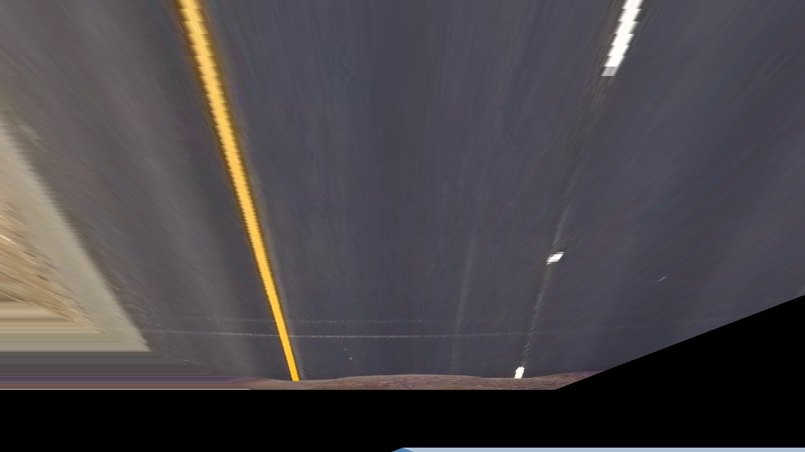

# GPU BEV on Bubbaloop + Kornia-RS Upstream

A real-time Bird's Eye View camera pipeline in Rust that demonstrates GPU-accelerated perspective
warp for edge-oriented deployment.

This repository serves two purposes:

- a working Bubbaloop-style application pipeline (Zenoh ingest -> process -> publish), and
- an upstream staging area for kornia-rs operation/backend contributions.

## Project Objective

Design and upstream a hardware-agnostic, zero-allocation GPU backend for kornia-rs using
CubeCL. This repository serves as the staging ground for the library API and uses a live
Bubbaloop Zenoh node exclusively as a real-world integration test to validate end-to-end
latency on edge hardware.

## Architecture

Two-layer architecture:

1. Library Layer (kornia-rs target)
- Pure operation API and backend implementations.
- No knowledge of network transport, camera topics, or viewer windows.

2. Application Layer (Bubbaloop target)
- Zenoh subscribe/publish, JPEG/PNG decode/encode, runtime orchestration.
- Calls operation API from the library layer.

## Processing Pipeline

```
Camera Frames (JPEG/PNG/RAW)
  |
  v
Zenoh Subscriber
  |
  v
Decode to RGB8 (CPU)
  |
  v
Pack RGB24 -> u32
  |
  v
warp_perspective operation API
  |
  +--> CPU backend (reference)
  |
  +--> CubeCL/WGPU backend (GPU)
  |
  v
Unpack u32 -> RGB24
  |
  v
Encode (optional JPEG)
  |
  v
Zenoh Publisher
```

## Project Structure

```
src/
├── main.rs                        # Live Zenoh BEV node (application layer)
├── lib.rs                         # Library exports
├── backend/
│   ├── mod.rs                     # ImageProcessor trait + backend exports
│   ├── cpu_backend.rs             # CPU reference warp backend
│   └── cubecl_backend.rs          # Persistent CubeCL/WGPU backend
├── imgproc/
│   ├── mod.rs                     # imgproc module exports
│   └── warp_perspective.rs        # Operation-level API wrapper
├── math/
│   ├── mod.rs
│   └── homography.rs              # IPM and homography utilities
├── nodes/
│   ├── mod.rs
│   ├── gpu_warp.rs                # CubeCL perspective warp kernel
│   ├── capture.rs                 # reserved capture integration stub
│   └── display.rs                 # reserved display integration stub
└── bin/
    ├── camera_publisher.rs        # Demo camera publisher
    ├── bev_viewer.rs              # Frame viewer
    └── warp_bench.rs              # OpenCV-reference benchmark utility
```

## Prerequisites

- Rust (edition 2024) via rustup
- GPU drivers/runtime compatible with wgpu backend
- Optional desktop session for viewer binary
- Python environment with `opencv-python` and `numpy` for OpenCV reference generation

## Build and Run

```bash
# Build sanity check
cargo check
```

### 1) Live GPU Node

```bash
CAM_WIDTH=1280 CAM_HEIGHT=720 \
BEV_BENCH=1 BEV_BENCH_WARMUP=30 BEV_BENCH_EVERY=60 BEV_LOOP_DELAY_MS=0 \
cargo run --release --bin gpu-bev-node
```

### 2) Publisher (Single Image Input)

```bash
CAM_WIDTH=1280 CAM_HEIGHT=720 \
CAM_PUB_PATH=images/frame.jpg CAM_PUB_FPS=5 CAM_PUB_LOOP=1 \
cargo run --bin camera_publisher
```

### 3) Optional Viewer

```bash
cargo run --release --features viewer --bin bev_viewer
```

## OpenCV Reference Benchmark

Step 1: Generate OpenCV reference output:

```bash
source .venv/bin/activate
python tools/verify_accuracy.py
```

Step 2: Run Rust GPU benchmark against OpenCV output:

```bash
CAM_WIDTH=1280 CAM_HEIGHT=720 \
BENCH_IMAGE_PATH=images/frame.jpg BENCH_OPENCV_REF=images/opencv_baseline_bev.png \
BENCH_WARMUP=10 BENCH_ITERS=100 BENCH_SAVE_OUTPUTS=1 \
cargo run --release --bin warp_bench
```

Benchmark output includes:

- GPU average latency
- Mean pixel difference against OpenCV output
- Max pixel difference against OpenCV output

## Visual Validation

### Input Frame


### Output Comparison (OpenCV vs Rust GPU)

| OpenCV Output | Rust GPU Output |
|---|---|
|  |  |

These output images are generated by the benchmark binary when `BENCH_SAVE_OUTPUTS=1`.

## Benchmark Report (Latest Run)

Command used:

```bash
CAM_WIDTH=1280 CAM_HEIGHT=720 \
BENCH_IMAGE_PATH=images/frame.jpg BENCH_OPENCV_REF=images/opencv_baseline_bev.png \
BENCH_WARMUP=10 BENCH_ITERS=100 BENCH_SAVE_OUTPUTS=1 \
cargo run --release --bin warp_bench
```

Measured results on this machine:

| Metric | Value |
|---|---|
| Resolution | 1280x720 |
| Iterations | 100 |
| OpenCV warp time (Rust-matrix baseline, single run) | 8.33 ms |
| GPU avg total | 5.214 ms |
| Mean abs pixel diff (GPU vs OpenCV) | 5.7361 |
| Max abs pixel diff (GPU vs OpenCV) | 213 |
| Match <=1 intensity diff | 77.12% |
| Match <=2 intensity diff | 85.69% |
| Match <=4 intensity diff | 91.34% |

Interpretation:

- The Rust GPU pipeline is functioning end-to-end and produces accurate BEV output against the
  OpenCV baseline using the same Rust-derived homography model.

**Performance Reality Check:** The current GPU benchmark result (5.214 ms) versus CPU/OpenCV
baseline run (8.33 ms) is only about a 1.6x speedup, which is below expected dedicated GPU gains.

**Bottleneck Identification:** The benchmark currently includes non-trivial overhead from
host-side orchestration, including PCIe Host-to-Device (H2D) transfer cost and per-frame WGPU
context/runtime initialization overhead. This indicates the dominant bottleneck is data movement
and runtime setup overhead, not the perspective warp math itself.

**Primary GSoC Target:** Upstream integration will prioritize persistent VRAM buffer pooling and
long-lived runtime resources in CubeCLBackend to reduce transfer/setup overhead and unlock stronger
parallel GPU speedups.

## Implemented

- Live Zenoh BEV node with decode -> warp -> publish path.
- CubeCL perspective warp kernel in Rust.
- Persistent CubeCL/WGPU backend (reuses client/queue/buffers/handles).
- Operation-level API wrapper for warp perspective.
- CPU reference backend for comparison.
- OpenCV-reference benchmark binary.
- Frame publisher and viewer binaries for demos.
- IPM homography configuration from environment variables.
- Stage-level benchmark logging for live pipeline (decode/pack/h2d/kernel/d2h/unpack/encode).

## Kornia Crate Coverage

| Crate | Current usage in this repo | Implemented status | Remaining upstream work |
|---|---|---|---|
| kornia-imgproc | Operation-facing warp flow and backend-dispatched perspective warp design | In progress | Upstream public warp API, backend dispatch integration, tests |
| kornia-image | Image container/types for decode scratch buffers and benchmark artifacts | Implemented in runtime flow | Keep as-is; align with tensor-native API contracts during upstreaming |
| kornia-io | JPEG/PNG decode and encode in node, viewer, publisher, benchmark tooling | Implemented in runtime flow | Upstream I/O helper usage patterns if needed for benchmark fixtures |
| kornia-tensor | Dependency included for target architecture alignment | Planned | Implement tensor-native warp API path and shape/stride-safe conversion strategy |

Notes:

- Current prototype computes with packed `u32` pixels for kernel bring-up and benchmarking.
- Upstream kornia-rs contribution should converge on tensor-native APIs centered on kornia-tensor.

## 12-Week GSoC Execution Plan

| Week | Phase | Focus and Deliverables | Exit Criteria |
|---|---|---|---|
| 1-3 | Kornia-RS API | Define ImageProcessor traits and operation boundaries in kornia-imgproc, implement tensor-native input/output layouts, and wire the standard CPU fallback path with tests and examples. | Draft PR for kornia-imgproc opened with API docs, compile-green tests, and reviewable usage example. |
| 4-6 | CubeCL Backend | Integrate CubeCLBackend into kornia backend dispatch logic and implement persistent WGPU context plus VRAM buffer pooling to reduce Host-to-Device transfer overhead. | Backend-dispatch PR opened, persistent resource path merged locally, and benchmark shows reduced transfer/setup share relative to current baseline. |
| 7-9 | Validation | Implement strict CPU-vs-GPU mathematical parity tests, build CI-compatible fixture tests, and finalize benchmark harness to demonstrate optimized GPU speedup after memory-path improvements. | CI-ready parity test suite passing and benchmark script producing reproducible report artifacts for CPU/GPU/OpenCV comparison. |
| 10-12 | Bubbaloop and Edge | Replace direct Bubbaloop app logic with the upstream kornia-rs API, deploy on NVIDIA Jetson Orin-class hardware, and publish final demo video with latency and throughput reporting. | End-to-end edge run validated on Jetson Orin-class device, final metrics table published, and upstream PR links consolidated in final report. |

## Proposal Success Criteria

- Upstream-first outcome: at least one kornia-rs API PR and one backend PR submitted with maintainer-reviewable scope.
- Systems outcome: persistent VRAM/resource strategy integrated so the measured bottleneck shifts away from per-frame transfer/setup overhead.
- Correctness outcome: reproducible CPU/GPU/OpenCV parity results with published fixtures and benchmark commands.
- Integration outcome: Bubbaloop node switched to kornia-rs public API and validated on edge hardware with reported latency.

## Troubleshooting

- If publisher exits quickly with CAM_PUB_LOOP=0, that is expected for one-shot publish.
- If decode fails, ensure CAM_WIDTH/CAM_HEIGHT match actual input resolution.
- If discovery fails on your network, run a Zenoh router and set ZENOH_CONFIG for all binaries.
- Viewer requires a desktop session.

## Current Status Summary

This repository already demonstrates core technical feasibility:

- Real-time GPU perspective warp is operational.
- The GPU output is benchmarked against an OpenCV reference baseline.

The remaining work is primarily upstreaming and integration hardening for kornia-rs and Bubbaloop.

## License

MIT
